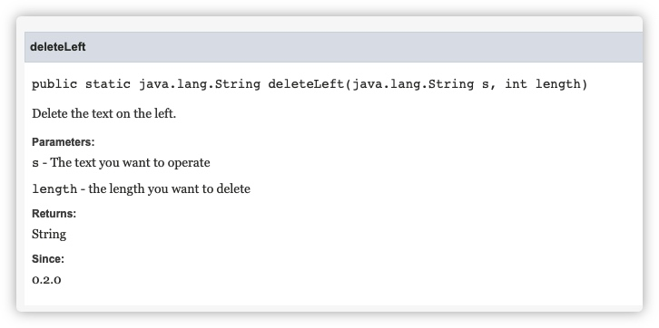

# Comment

**Comment** is the explanation or introduction for one statement, code segment, function when programming. It can improve the readability of code. It aims that every person can understand the code easely.

The content in comment wont be processed by **compiler** or **interpreter**.

In Java, there are 3 types of comment:

- **Single-line comment**
- **Multi-line comment**
- **Document comment**

## Single-line comment

In Java, **Single-line comment** is marked by `//`. The content behind `//` till line break is the comment.

For example:

```java
// This is comment
```

```java
System.out.println("Hello World!");  // Output "Hello World" on the console
```

## Multi-line comment

In Java, **Multi-line comment** is marked by `/* ... */`. Between `/*` and `*/` is the comment.

For example:

```java
/*
  I am the comment,
  and here is another line.
  ...
 */
```

## Document comment

In Java, **Document comment** is marked by `/** ... */`. Between `/**` and `*/` is the document comment content.

**Document comment** usually appears before **Class declaration**, **Field declaration**, **Method declaration** and etc. It will be parsed by `javadoc` and generate the corresponding document content.

Take [the following code](https://github.com/gtn1024/VousUtils/blob/main/src/main/java/com/vousutils/text/UtilsText.java#L8-L20) for example:

```java
    /**
     * Delete the text on the left.
     *
     * @param s      The text you want to operate
     * @param length the length you want to delete
     * @return String
     * @author Taoning Ge
     * @since 0.2.0
     */
    public static String deleteLeft(String s, int length) {
        if (s == null || s.length() <= length) return "";
        return s.substring(length);
    }
```

When it is processed by `javadoc`, it will be like the picture below:

[Here](<https://javadoc.vousutils.com/0.2.2/com/vousutils/text/UtilsText.html#deleteLeft(java.lang.String,int)>) is the link.



If you are interested in **Document comment**, you can read the project: [GitHub](https://github.com/gtn1024/VousUtils) [Javadoc](https://javadoc.vousutils.com/0.2.2/index.html)
