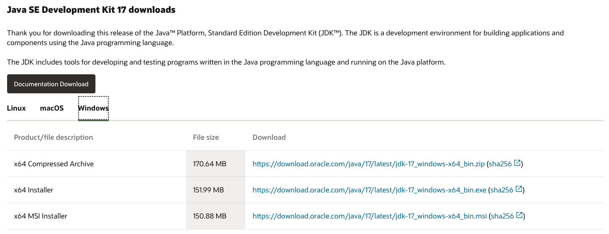

# How to Install Java

In the world of Java, there are a lot of companies providing JDK(such as [OpenJDK](https://jdk.java.net/17/), [Oracle JDK](https://www.oracle.com/java/technologies/downloads/), [Azul Zulu JDK](https://www.azul.com/downloads/?package=jdk), [Temurin (AdoptOpenJDK before)](https://adoptium.net/) and etc). The licenses they use are different, and some require payment for commercial use.

As a developer, the most commonly used one is [Oracle JDK](https://www.oracle.com/java/technologies/downloads/). And this article will be based on it.

## Windows Platform

### Download JDK

Open [the official site of Oracle JDK](https://www.oracle.com/java/technologies/downloads/), switch to **Windows**. Choose the suitable one to download.



Oh, yeah. You can also download from this page.

- [x64 Compressed Archive](https://download.oracle.com/java/17/latest/jdk-17_windows-x64_bin.zip)
- [x64 Installer](https://download.oracle.com/java/17/latest/jdk-17_windows-x64_bin.exe)
- [x64 MSI Installer](https://download.oracle.com/java/17/latest/jdk-17_windows-x64_bin.msi)

After downloading the file, **decompress the package** or **install** it to someplace (e.g. `C:\Develop\jdk-17`)

### Configure Environment Variable

1. Add `JAVA_HOME` which points to `C:\Develop\jdk-17`
2. Add `%JAVA_HOME%\bin` to `Path`

## macOS Platform

### Download JDK

- [Arm 64 Compressed Archive](https://download.oracle.com/java/17/latest/jdk-17_macos-aarch64_bin.tar.gz)
- [Arm 64 DMG Installer](https://download.oracle.com/java/17/latest/jdk-17_macos-aarch64_bin.dmg) (Recommended)
- [x64 Compressed Archive](https://download.oracle.com/java/17/latest/jdk-17_macos-x64_bin.tar.gz)
- [x64 DMG Installer](https://download.oracle.com/java/17/latest/jdk-17_macos-x64_bin.dmg) (Recommended)

Note:

1. Please use **Arm 64** version if you are using a mac with **Apple Silicon**
2. You need to decompress it to a suitable place (e.g. `~/Develop/jdk-17`) if you use **Compressed Archive**

### Configure Environment Variable

Open `~/.bash_profile` or `~/.zprofile` with any editor. Add the following at the bottom of the file.

```bash
# Compressed Archive
export JAVA_HOME="/Users/[USERNAME]/Develop/jdk-17"
# Installer
export JAVA_HOME=`/usr/libexec/java_home -v 17`
export PATH=$JAVA_HOME/bin:$PATH
```

## Check the Installation

Open `cmd`(Windows) or `Terminal`(macOS), type `java -version`. If you can see the right information about JDK, I must congratulate you on your JDK installation.

```bash
$ java -version
java version "17" 2021-09-14 LTS
Java(TM) SE Runtime Environment (build 17+35-LTS-2724)
Java HotSpot(TM) 64-Bit Server VM (build 17+35-LTS-2724, mixed mode, sharing)
```
