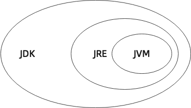

# Introduction of Java

## What is Java

> Java is one programming language that is used worldwide. It has features like cross-platform, object-oriented and generic. Also, Java is widely used in enterprise Web application development and mobile application development.

All right... I must acknowledge that you would not read the content above. Now I will mention the emphasis.

- The popularity of Java on the is always at the forefront. For more details, please see [TIOBE index](https://www.tiobe.com/tiobe-index/)
- Java is in high demand.
- Java is a cross-platform programming language. Write once, run everywhere.
- Java can collect garbage automatically.
- Java ...

## History of Java

The birth of Java can be the revolt against C/C++. It does not hava the point in C/C++, you do not need to consider memory management, and it fully support cross-platform.

The original name of Java was `C++--`, which was intended to improve C++. However, the founder found that the difference of design philosophy was too large, and then named it `Oak`. When it was to release, he found the copyright of `Oak` was used by others. So, the programming language is called `Java`.

After Java gradually became famous, some giants, like [Oracle](https://www.oracle.com/index.html), [Microsoft](https://www.microsoft.com/zh-cn/), cooperated with `Java`. BTW, [Bill Gates](https://en.wikipedia.org/wiki/Bill_Gates)(founder of Microsoft) said Java was the best designed programming language till then.

In 2006, the framework [Hadoop](https://hadoop.apache.org/) made Java into the Big Data field.

In 2008, the birth of [Android](https://www.android.com/) took Java to a whole new level. The applications in Android are almost developed with Java.

## Edition of Java

There are 3 editions of Java:

- **Java SE**(Standard Edition)
- **Java EE**(Enterprise Edition) (Now called **Jakarta EE**)
- **Java ME**(Micro Edition)

**Java SE** is the Standard Edition. It provides standard JVM and standard libraries.

**Java EE** is the Enterprise Edition. It adds a plenty of API and libraries based on Java SE, which makes it convenient to develop Web Application or Database. The Virtual Machine Java EE used is the same as Java SE. In 2018, Oracle turned Java EE to [Eclipse Foundation](https://www.eclipse.org/org/foundation/), and it was renamed to Jakarta EE.

**Java Me** can be called **Java lite**. It was the edition for embedded devices.

## Some jargons

Here are some of the names you'll hear when you're new to Java

As you are new to Java, you must hava heard the jargons below:

- **JDK**(Java Development Kit)
- **JRE**(Java Runtime Environment)
- **JVM**(Java Virtual Machine)

The picture below shows the relationship between these three:

