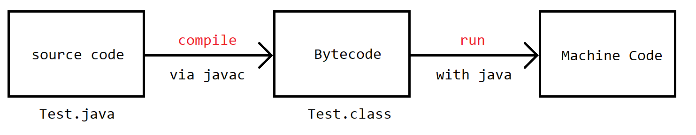

# The First Program

## Type and Run the Code

First, launch one code editor(e.g. [Sublime](https://www.sublimetext.com/)), type the code below:

```java
public class Hello {
  public static void main(String[] args){
    System.out.println("Hello, World!");
  }
}
```

Save the code to `Hello.java`. Launch your Terminal(If you are a Windows user, it is recommended to use [Powershell](https://docs.microsoft.com/en-us/powershell/) or [Git Bash](https://git-scm.com/download/win)). Change the folder to the directory `Hello.java` was saved. Type `javac Hello.java`.

If everything goes OK, there is no output on the console. And you can find `Hello.class` in the current directory.

```bash
$ javac Hello.java
$ ls
Hello.class	Hello.java
```

Now, type `java Hello`. You will see the output below:

```bash
$ java Hello.java
Hello, world!
```

## Analyze the First Program

In any Java program, you can find the following code:

```java
public class Hello { ... }
```

It defines a **class** called `Hello`. `public` means it is a public class.

In `Hello` class, we also define a method called `main`.

```java
public static void main(String[] args){
    System.out.println("Hello, World!");
}
```

The method `main` is the entry method of a Java program. `String[] args` means this method accept an argument with the type of `String[]`. `public` and `static` are modifier, which will be mentioned later.

`System.out.println("Hello, World!");` stands for outputting `Hello World` on the console.

In Java, every statement must end with a semicolon (`;`).

## How Java Works

The source code of Java program is just a plain text file in essence. We use `javac` to compile the source code to [byte code](https://en.wikipedia.org/wiki/Bytecode), then we use `java` to launch the program (i.e. the byte code file).

The general mechanism is below:


