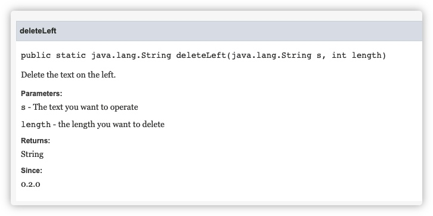

# 注释

注释就是对代码的解释和说明，其目的是让人们能够更加轻松地了解代码。注释是编写程序时，写程序的人给一个语句、程序段、函数等的解释或提示，能提高程序代码的可读性。

注释中的内容不会被**编译器**、**解释器**所处理。

在 Java 中，注释有以下 3 种类型：

- 单行注释
- 多行注释
- 文档注释

## 单行注释

在 Java 中，单行注释使用`//`来标记，从`//`开始直到换行为止全部为注释内容，将被编译器忽略。

例如：

```java
// 这里为注释
```

```java
System.out.println("Hello World!");	// 在控制台上输出Hello World内容
```

## 多行注释

在 Java 中，多行注释使用`/* ... */`来标记。在`/* */`内部的内容均为注释内容，被编译器忽略

例如：

```java
/*
  我是一段注释
  我可以换行
  ...
 */
```

## 文档注释

在 Java 中，单行注释使用`/** ... */`来标记，在中间的内容均为文档注释内容。

文档注释通常出现在**类**、**成员变量**、**成员方法**等声明前时，将会被`Javadoc`工具解析并生成对应的文档内容。

例如下面这一段代码（[链接](https://github.com/gtn1024/VousUtils/blob/main/src/main/java/com/vousutils/text/UtilsText.java#L8-L20)）：

```java
    /**
     * Delete the text on the left.
     *
     * @param s      The text you want to operate
     * @param length the length you want to delete
     * @return String
     * @author Taoning Ge
     * @since 0.2.0
     */
    public static String deleteLeft(String s, int length) {
        if (s == null || s.length() <= length) return "";
        return s.substring(length);
    }
```

使用 Javadoc 工具处理后如下图所示（[链接](<https://javadoc.vousutils.com/0.2.2/com/vousutils/text/UtilsText.html#deleteLeft(java.lang.String,int)>)）：



对于文档注释大家可以阅读该项目：[GitHub 代码链接](https://github.com/gtn1024/VousUtils) [Javadoc 链接](https://javadoc.vousutils.com/0.2.2/index.html)
